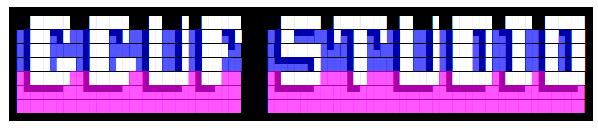
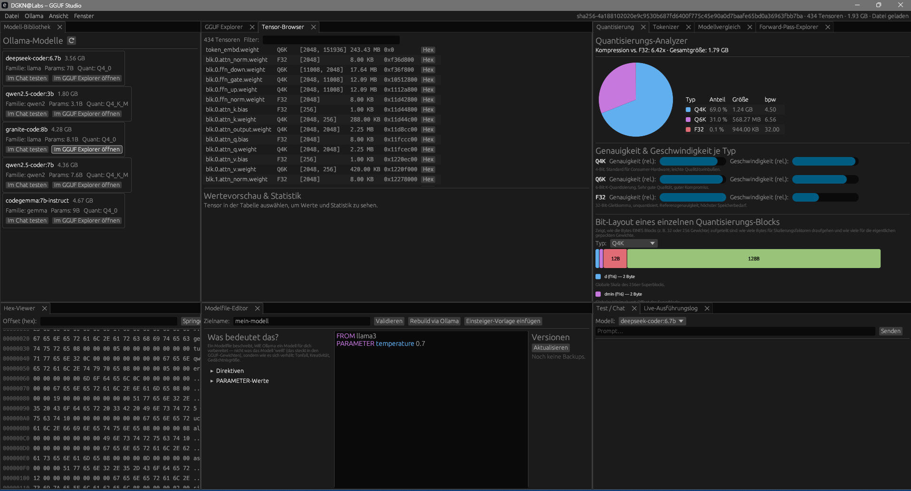

<div align="center">



**Eine native Rust-Desktop-IDE für GGUF-Modelle & Ollama.**
GGUF-Dateien analysieren, Modelle vergleichen, Quantisierung verstehen, echte Forward-Passes durchrechnen — alles lokal, alles ohne die Datei jemals komplett in den RAM zu laden.

[](https://www.rust-lang.org/)
[](#lizenz)
[](https://github.com/emilk/egui)
[](#build--start)
[](https://ollama.com)

</div>

---

## Inhaltsverzeichnis

- [Warum GGUF Studio?](#warum-gguf-studio)
- [Features](#features)
- [Screenshots](#screenshots)
- [Build & Start](#build--start)
- [Architektur](#architektur)
- [Performance-Prinzipien](#performance-prinzipien)
- [Module / Panels im Detail](#module--panels-im-detail)
- [Der Forward-Pass-Explorer](#der-forward-pass-explorer)
- [Backups & Versionierung](#backups--versionierung)
- [Plugin-Architektur](#plugin-architektur)
- [Roadmap](#roadmap)
- [Mitwirken](#mitwirken)
- [Lizenz](#lizenz)
- [Über dieses Projekt & KI-Mitentwicklung](#über-dieses-projekt--ki-mitentwicklung)

---

## Warum GGUF Studio?

Wer lokale LLMs über Ollama nutzt, landet früher oder später bei Fragen wie: *Was steckt eigentlich in dieser `.gguf`-Datei? Welche Quantisierung, welche Architektur, wie viele Parameter? Warum ist Modell A doppelt so groß wie Modell B? Und wie "denkt" so ein Modell eigentlich — was passiert zwischen Eingabe-Text und Antwort?*

GGUF Studio beantwortet das, ohne die Kommandozeile zu bemühen oder Python-Skripte zu schreiben — als schnelle, native Desktop-Anwendung, die auch mit >100 GB großen Modelldateien flüssig umgeht, weil **niemals eine komplette Datei in den Speicher geladen wird** (Memory-Mapping + Lazy Loading + virtuelles Scrolling überall).

## Features

- 🗂️ **Automatische Ollama-Bibliothek** — erkennt installierte Modelle beim Start, inkl. Größe, Architektur, Quantisierung
- 🔍 **GGUF Explorer** — Header, Version, alle Key-Value-Metadaten, durchsuchbar
- 🧩 **Tensor-Browser** — jeder Tensor mit Name, dtype, Shape, Offset; echte Dequantisierung + Statistik/Histogramm für eine Wertevorschau
- 🎚️ **Quantisierungs-Analyzer** — Kreisdiagramm der Speicherverteilung, Bits pro Gewicht, Kompressionsrate vs. F32, relative Genauigkeit/Geschwindigkeit je Quant-Typ, **plus ein Bit-Layout-Diagramm**, das exakt zeigt, wie die Bytes eines einzelnen Quantisierungs-Blocks aufgeteilt sind (Skala, Sub-Skalen, gepackte Gewichte — nach dem echten ggml-Blocklayout)
- 🔡 **Tokenizer-Explorer** — alle Vokabeltokens mit ID, Byte-Hex-Darstellung, Typ, Special-Tokens (BOS/EOS/…), Suche
- 🆚 **Modellvergleich** — zwei GGUF-Dateien gegenüberstellen: Header-, Metadaten-, Tensor- und Tokenizer-Diff, farblich markiert
- 🧮 **Forward-Pass-Explorer** — rechnet Embedding + echte Transformer-Layer (RMSNorm, RoPE, GQA-Attention, SwiGLU-FFN) **mit den tatsächlichen Gewichten** durch und erklärt jeden Schritt in Klartext
- 📡 **Live-Ausführungslog** — protokolliert bei jedem Forward-Pass-Lauf in Echtzeit JEDEN tatsächlichen Datei-Lesezugriff (welcher Tensor, welcher Offset, wie viele Bytes, warum) — unabhängig vom Eingabetext, mit abschließender Zusammenfassung und Log-Export als Textdatei
- 🔬 **Hex-Viewer mit Editiermodus** — Offset-Navigation, Hex+ASCII, blockweises Laden, Copy-on-Write-Patches mit Auto-Backup vor dem Speichern
- 📝 **Modelfile-Editor mit Lern-Sidebar** — Syntax-Highlighting, Validierung, Versionsverwaltung mit Wiederherstellung, direkter Rebuild über die Ollama-API, **plus eine erklärende Seitenleiste**, die jede Direktive (`FROM`, `SYSTEM`, `TEMPLATE`, …) und jeden `PARAMETER`-Wert (`temperature`, `top_p`, `num_ctx`, …) in Klartext erläutert — inklusive Einsteiger-Vorlage per Klick
- 💬 **Test/Chat-Panel** — Prompts direkt gegen ein Ollama-Modell senden, Streaming-Antworten, tok/s-Benchmark
- 🧱 **Plugin-Architektur** — jedes Panel ist ein austauschbares Trait-Objekt in einer Registry, kein hartcodiertes Enum
- 🌓 **Dark/Light Mode**, dockbare, frei anordenbare Panels, Tastenkürzel

## Screenshots



*Modell-Bibliothek (links) mit direktem Öffnen im GGUF Explorer, Tensor-Browser mit allen 434 Tensoren einer geladenen Datei, Quantisierungs-Analyzer mit Kreisdiagramm der Speicherverteilung und Bit-Layout-Diagramm eines Q4_K-Blocks, Hex-Viewer, Modelfile-Editor mit Erklär-Sidebar — alles gleichzeitig als frei anordenbare, dockbare Panels.*

## Build & Start

```bash
git clone https://github.com/dogenc/gguf-studio.git
cd gguf-studio
cargo run --release -p gguf-studio
```

**Voraussetzungen:**
- Rust ≥ 1.75 (Edition 2021)
- Optional, aber empfohlen: eine laufende [Ollama](https://ollama.com)-Instanz unter `http://127.0.0.1:11434` für die Modell-Bibliothek, den Chat-Test und den Modelfile-Rebuild

Zum Öffnen einer GGUF-Datei: **Strg+O**, oder in der Modell-Bibliothek direkt auf **„Im GGUF Explorer öffnen“** bei einem Ollama-Modell klicken (löst den internen Blob-Pfad automatisch auf — Ollama speichert Modelle ohne `.gguf`-Endung).

## Architektur

```
crates/
  gguf-core/      GGUF-Parser: mmap, Zero-Copy, Lazy. Header, KV-Metadaten,
                  Tensortabelle, GGML-Typen inkl. K-/IQ-Quants, Dequantisierung,
                  Quant-Analyzer, Tokenizer-Extraktion, Modell-Diff.
  hexview/        Blockbasierter Hex-Reader (nur sichtbares Fenster wird
                  gelesen), Mustersuche in 4-MiB-Chunks, Copy-on-Write-Edit
                  mit Backup-Commit, für Dateien beliebiger Größe.
  ollama-client/  Async-REST-Client: list/show/generate (Streaming)/create/
                  unload, Benchmarks (tok/s), Modelfile-Validator, Auflösung
                  von Ollama-Modellnamen zu lokalen Blob-Pfaden.
  inference/      Mini-Forward-Pass-Engine: rechnet Embedding + einzelne
                  Transformer-Layer mit den echten (dequantisierten) Gewichten
                  einer geladenen Datei durch — RMSNorm, RoPE, GQA-Attention,
                  SwiGLU-FFN, Softmax — inklusive Klartext-Erklärungen je Schritt.
  app/            egui + egui_dock UI: Plugin-Registry für Panels, animierter
                  Splashscreen, Dark/Light Mode, Tastenkürzel, virtuelles
                  Scrolling überall, Tokio-Bridge (mpsc) für async → UI,
                  Backup-Modul.
```

## Performance-Prinzipien

- **Niemals** wird eine Modelldatei vollständig in den RAM geladen.
- `memmap2`: das Betriebssystem lädt Pages on demand; alle Zugriffe sind Zero-Copy-Slices ins Mapping.
- UI-Listen (Metadaten, Tensoren, Hex, Tokens) rendern per `show_rows` ausschließlich sichtbare Zeilen — auch bei Millionen Einträgen bleibt die UI flüssig.
- Parsing, Netzwerk-Calls und der Forward-Pass laufen auf Tokio-Workern (`spawn_blocking` für CPU-lastige Arbeit) — die UI blockiert nie.

## Module / Panels im Detail

| Panel | Funktion |
|---|---|
| **Modell-Bibliothek** | Auto-Erkennung aller Ollama-Modelle inkl. Größe, Familie, Quantisierung; direktes Öffnen im GGUF Explorer |
| **GGUF Explorer** | Header, Version, Architektur, alle KV-Metadaten, Filter |
| **Tensor-Browser** | Name, dtype, Shape, Größe, Offset, Sprung in den Hex-Viewer; echte Wertevorschau (Dequantisierung F32/F16/BF16/Q4_0/Q8_0/Q4_K/Q6_K u. a.) mit Min/Max/Mean/Std und Histogramm |
| **Quantisierung** | Kreisdiagramm der Speicherverteilung, Bits pro Gewicht, Kompressionsrate vs. F32, relative Genauigkeit/Geschwindigkeit je Typ, Bit-Layout-Diagramm eines einzelnen Blocks, Erklärtexte |
| **Tokenizer** | Alle Tokens mit ID, Byte-Hex-Darstellung, Typ (Normal/Control/Byte/…), Score, Special-Token-Übersicht, Suche nach Text oder ID |
| **Modellvergleich** | Zwei GGUF-Dateien gegenüberstellen: Header-, Metadaten-, Tensor- und Tokenizer-Diff, farblich markiert (geändert/nur A/nur B) |
| **Forward-Pass-Explorer** | Echte Berechnung von Embedding + 1–8 Transformer-Layern mit den tatsächlichen Modellgewichten, Schritt-für-Schritt-Erklärungen, Attention-Gewichte, Top-Token-Vorhersage |
| **Live-Ausführungslog** | Echtzeit-Liste jedes Datei-Lesezugriffs während des letzten Forward-Pass-Laufs (Tensor, Offset, Bytes, Grund), Zusammenfassung nach Tensor, Export als `.txt` |
| **Hex-Viewer** | Offset-Navigation, Hex+ASCII, virtuelles Scrolling, Blockladung, Bearbeitungsmodus mit Copy-on-Write-Patches + Auto-Backup vor dem Speichern |
| **Modelfile-Editor** | Syntax-Highlighting (Direktiven/Parameter/Kommentare/Strings), Validierung, Auto-Backup, Versionsverwaltung mit Wiederherstellung, direkter Rebuild via `POST /api/create` |
| **Test / Chat** | Streaming-Antworten, tok/s-Benchmark in der Statusleiste |

## Der Forward-Pass-Explorer

Das Herzstück für alle, die verstehen wollen, *wie* ein LLM tatsächlich rechnet — Antwort auf Fragen wie „was passiert eigentlich, wenn ich Hallo eingebe?“:

1. **Tokenisierung** — der Prompt wird gegen das echte Vokabular der Datei zerlegt; jedes Token bekommt seine ID, mit einer Erklärung, warum diese Zerlegung der einzige Input ist, den das Modell je sieht (nie den Rohtext selbst).
2. **Embedding-Lookup** — jede Token-ID wird zur Zeilennummer in der Embedding-Matrix; der zugehörige Datei-Ausschnitt lässt sich per Klick direkt im Hex-Viewer öffnen.
3. **RMSNorm → Q/K/V-Projektion + RoPE → Softmax-Attention (inkl. Grouped-Query-Attention) → SwiGLU-Feed-Forward → Output-Projektion** — echte Matrixmultiplikationen mit den **tatsächlichen, dequantisierten Gewichten** der geladenen Datei, keine Simulation.

**Jeder einzelne Schritt zeigt:**
- eine verständliche Klartext-Erklärung, was gerade passiert und warum
- einen echten Zahlen-Ausschnitt des Zwischenergebnisses
- Buttons **„🔎 Im Hex-Viewer zeigen“** zu jedem verwendeten Gewichtstensor — du siehst exakt den Datei-Offset und die rohen Bytes, aus denen dieser Rechenschritt seine Zahlen bezogen hat

Damit lässt sich die Frage *„woher weiß das Modell, wie es antworten muss“* konkret nachvollziehen: am Ende steht eine Wahrscheinlichkeitsverteilung über das gesamte Vokabular (die „Logits“), die das reine Ergebnis der trainierten Gewichte ist — kein Nachschlagen von Fakten, sondern das, was beim Training am häufigsten in ähnlichem Kontext vorkam.

**Bewusste Grenzen** (transparent im UI dokumentiert):
- Nur 1–8 Layer werden gerechnet, nicht das komplette Modell (Performance)
- Der Tokenizer ist ein vereinfachter Greedy-Longest-Match, kein vollständiger BPE-Encoder
- Einige seltenere Quantisierungstypen nutzen noch eine grobe Näherung statt eines exakten Dekoders

## Backups & Versionierung

- Vor jedem Rebuild wird das Modelfile zeitgestempelt + SHA-256-gehasht unter `<Datenverzeichnis>/gguf-studio/backups/<name>/` abgelegt und ist im Modelfile-Editor per Klick wiederherstellbar.
- Vor jedem Speichern im Hex-Editor wird die Originaldatei nach `<Datenverzeichnis>/gguf-studio/backups/files/` kopiert, bevor Copy-on-Write-Patches auf die Platte geschrieben werden.

## Plugin-Architektur

Jedes Panel implementiert das `PanelPlugin`-Trait (`app/src/plugin.rs`) und wird in einer `PluginRegistry` unter einer stabilen String-ID registriert. Das Dock referenziert Panels nur über diese ID — neue Panels (auch künftig dynamisch geladene Erweiterungen) hängen sich per `PluginRegistry::register` ein, ohne dass Kernmodule geändert werden müssen.

## Roadmap

- [ ] Vollständiger BPE/SentencePiece-Tokenizer statt Greedy-Match
- [ ] Exakte Dequantisierungs-Dekoder für alle IQ-/K-Quant-Typen
- [ ] Forward-Pass über das komplette Modell (alle Layer) mit Fortschrittsanzeige
- [ ] Export von Modellvergleichen als Markdown/HTML-Report
- [ ] Dynamisch ladbare Plugins (externe `.dll`/`.so`) über die bestehende Registry

Beiträge zu jedem dieser Punkte sind willkommen — siehe [Mitwirken](#mitwirken).

## Mitwirken

Issues und Pull Requests sind willkommen. Bevor du eine größere Änderung startest, leg gerne kurz ein Issue an, um die Richtung abzustimmen. Bitte:

1. Fork erstellen, Feature-Branch anlegen
2. `cargo fmt` und `cargo clippy --workspace` sauber halten
3. PR mit kurzer Beschreibung, was und warum

## Lizenz

Dieses Projekt steht unter **MIT OR Apache-2.0** — wähle die für dich passende Lizenz:
[LICENSE-MIT](LICENSE-MIT) · [LICENSE-APACHE](LICENSE-APACHE)

## Über dieses Projekt & KI-Mitentwicklung

GGUF Studio ist mit Unterstützung von KI (Claude, Anthropic + KIMI) entstanden — vom ersten Grundgerüst bis zu den Panels, der Inferenz-Engine und diesem README. Das ist hier kein Kleingedrucktes, sondern offen so gedacht: Idee, Architekturentscheidungen und Richtung kommen vom menschlichen Maintainer, die KI hilft beim Umsetzen, Erklären und Verbessern.

Wenn dir beim Lesen des Codes etwas komisch vorkommt, eine Erklärung nicht stimmt oder eine Idee für ein neues Panel/Feature im Kopf herumspukt: das ist genau der Punkt dieses Projekts. Kein Ansatz ist zu unausgereift, um ihn zu notieren — ob per Issue, PR oder einfach als Nachricht an die KI beim Weiterentwickeln. Lieber ausprobieren, anpassen, wieder verwerfen, als aus Scheu vor "falschen" Ideen gar nichts zu versuchen.

---

<div align="center">

Gebaut mit 🦀 Rust, [egui](https://github.com/emilk/egui) und [egui_dock](https://github.com/Adanos020/egui_dock) — für alle, die lokale LLMs nicht nur benutzen, sondern verstehen wollen.

</div>
